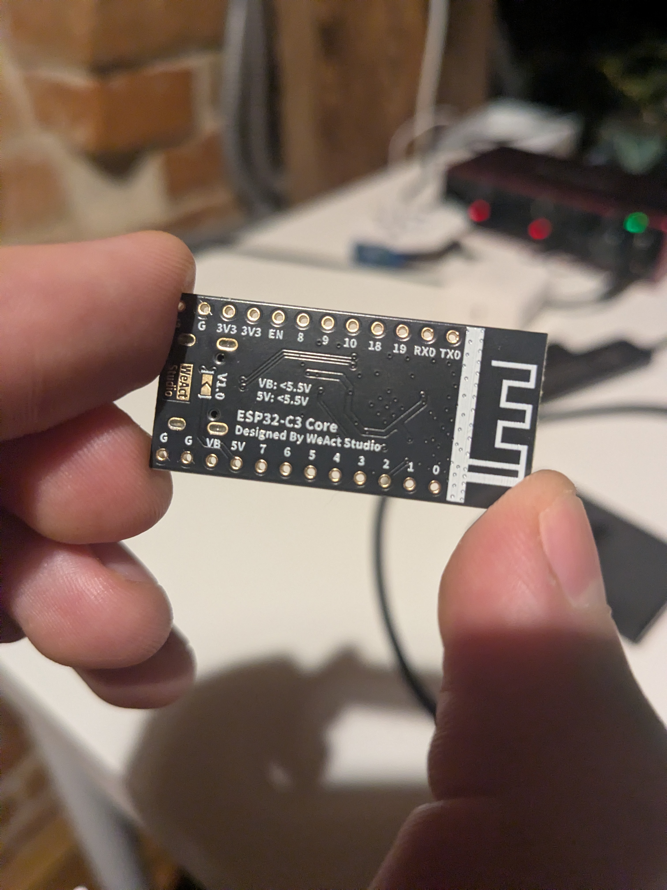
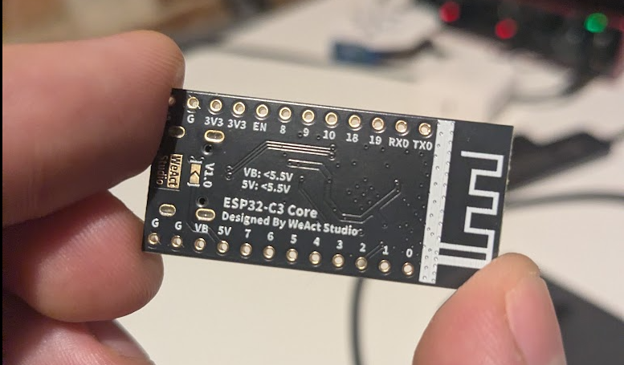
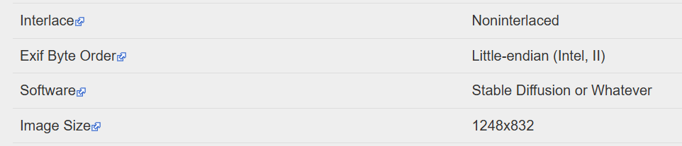
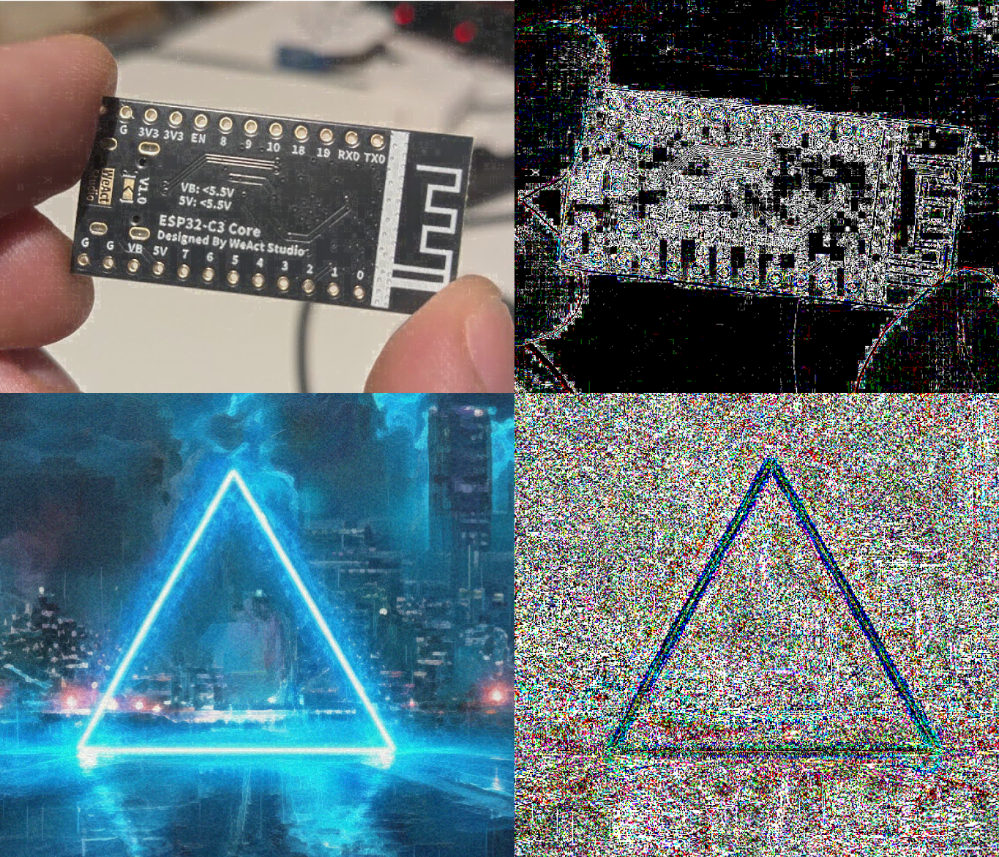

# Image Forensics: AI or IRL?

## Overview

With the advent of generative AI, it's become harder than ever to determine whether an image you are looking at (or video you are watching while doomscrolling when you should be in bed) is genuine. 

A [recent Axios article](https://www.axios.com/2025/10/14/ai-generated-writing-humans "no this isn't a fake link") quoted a 2022 Europol report predicting that 90% of the internet would be generated by AI in 2026. Given the dramatic effect actual "fake news" and bot/disinformation networks have already had on Western societies, this is, in some ways, a **truly terrifying** statistic - Happy New Year to us all indeed.

Fortunately, when technology adapts, people tend to as well, however begrudgingly. This in turn generates another issue, though - while there are tools out there that claim to help people "detect" AI images, they are often pretty superficial in what they actually check. Best case scenario, they give you a "maybe". Worst case, they're completely unreliable. 

On top of that, beyond giving something a solid one-over with our eyes, how can we even determine what makes an image/video fake or not? Recent events have shown that folks young and old are constantly bumping into content that they can't definitively assign to either camp, and the smattering of "HoW tO DeTeCt Ai ImaGeS" articles on the internet don't seem to include much beyond "do the people in the image have the right number of mouths?"

We can do better.

## Objective

Put together a guide to help people understand:
- how AI-generated images differ from other types of digital images;
- how to verify the provenance (i.e. origin) of an image;
- what/how you can check for yourself (given the correct tools, a bit of included know how, and a few clicks);

This article will not cover in-depth image forensics, since that's a massive field of study. Digital imagery itself is complex and there are many rabbit holes to get lost down. 

Instead, we'll will break down introductory concepts and show what steps you can take to investigate, should you have the desire and tools to do so.

## The Easy Stuff

Stage 1 of confirming whether you're in the Uncanny Valley is the easiest of all - 

> *Assume that any image you see could have been generated by AI until proven otherwise.*

Yes, we've crossed that Rubicon. Fortunately, we're still early in the AI era, so a lot can be done pretty without "popping the hood" on the image itself.

### What to Check

Using only your eyes, look for things like:
- obviously incorrect details (e.g. a hand having too many/few fingers, gibberish text, background elements being warped);
- the "AI airbrush" that removes textures from surfaces or makes things look "too clean" or "over-produced";
- socially or culturally incompatible or inappropriate things (e.g. a Muslim eating bacon, the Pope flipping someone the bird, etc.)

You can also perform a **reverse search of the image** - if there's no record of this photo (or its contents, i.e. people) on legit websites or it's scattered in random places, that could be a signal that the picture is AI-generated.

Finally, if your proverbial "spidey senses" are tingling just by looking at a picture but you can't quite put your finger on why, that's your brain telling you something's up. The internet is flooded with AI-generated or AI-enhanced slop, and much of it is crafted specifically to evoke a reaction from people who don't know any better than to not trust everything they see online.

This is particularly true when an image touts or supports a certain political point of view, as pointed out in [this Reddit 
post](https://www.reddit.com/r/AskUK/comments/1piwz50/young_people_how_can_you_tell_if_an_image_was/).

So, assuming a picture pasts all of these litmus tests but doubt remains (or maybe you just want to be thorough!), what else can we examine?

## What is Metadata?

All files have metadata, and that includes images. More specifically, image-specific formats (PNG, JPG, TIFF, etc.) have telltale markers that point to their origin.

From this point on, it'll be useful to break images into three rough categories:
- AI-generated images;
- Common digital images (e.g. screenshots, digital art);
- Camera images (e.g. DSLR, raw, phone pictures);

This'll give us both ends of a spectrum as well as a nice middle point.

One of the most important formats of metadata for images is called [exchangeable image file format](https://en.wikipedia.org/wiki/Exif), or **EXIF**. EXIF metadata can contain a mind-boggling amount of information, including: 
- the exact location (GPS coordinates) and time when a photo was taken; 
- the camera's manufacturer and model; 
- the image's resolution and compression; 
- various camera settings, including exposure time and type of flash used; 
- the name of the camera owner (if you're using Canon's Digital Photo Professional and not being careful);

In some cases, manufacturers pack even more information into what are called [MakerNote tags](https://en.wikipedia.org/wiki/Exif#MakerNote_data), and there are [easily accessible public-facing databases](https://exiftool.org/makernote_types.html) that further decode these tags for thousands of devices.

OPSEC fun side quest: can you find the tags for a device you own?

## Metadata - Camera Images

When it comes to which category of pictures has the most EXIF data, that's an easy winner - "old school pictures" from a dedicated camera, with other traditional JPEGs coming in second.

How much data are we talking about, exactly? Well, let's just go to a dead-simple [free EXIF metadata extractor](https://exif.tools) and plug in a photo my buddy sent me of his apartment over Google Photos, which we know [thanks to the table on this website](https://aboutthisimage.com/social-media-metadata) does **not sanitize any data from any of the content stored on it**.

What information did I get from this one picture?
- version history, or the exact time (MM:HH:DD:MM:YYYY) that the picture was taken, as well as for all of its future versions;
- the software used to edit the photo and a history for updates in the software (i.e. how many times it was edited, saved, converted, etc.);
- the specific transformations applied to the photo by the software (perspective shift, in this case);
- the camera's make, model name, manufacturer, and various codes associated with it;
- the information, model, settings, and ID of the lens;
- **the original ("raw") name of the image file** - this means I know the name of legitimate files on **someone else's system**.

Obviously, this is less than ideal, and the same goes for pictures on your phone camera to a lesser degree. 

(Yes, this is an Easter Egg for an upcoming project guide :-D )

When checking the EXIF here, I get some information, but not much: phone model and manufacturer, which camera I used on the phone to take the picture, creation datetime stamp, etc. This difference comes down to a lot of things - the devices used, the fact that I didn't edit my phone picture, different cameras populating different EXIF fields, etc.

At this point, you may ask - why can these JPEGs have so much information stuffed into them? 

JPEGs, like all images, have metadata because photographers and camera manufacturers wanted a way to standardize things like shot diagnostics, accurate image reproduction, and post-processing. Only in our eternally-online, cynical world did our heightened privacy concerns appear alongside expansions to these formats.

Also, JPEG is actually 2 things: 
1) a file format that's been the global standard for digital photography since 1992 - i.e. *how the image information is stored post-capture*; 
2) a lossy compression method - i.e. *how the image information is generated and processed when a picture is taken*;

For those curious, **lossy** compression is a method where image integrity is actually lost during compression. While professional photographers can choose to shoot in RAW (a lossless format) we mortals get default JPEG format in our cameras and cameraphones.

Why? Simply because JPEG's lossy compression makes the photo sizes **much** smaller and, because it is optimized for digital photography, the visible differences are often negligible.

Fun Side Quest: ask a photographer (or Reddit) what the file size was of the "largest" RAW photo they ever took. The answer may surprise you!

Incidentally, the magic of modern-day cameras and the processes by which they create photos can also generate things like:
- JPEG compression artifacts;
- thumbnails stored inside of the image itself (yes! Where do you think your phone/computer gets the tiny replica of a full picture when you're scrolling your Gallery or File Explorer?);
- modern-day photo optimization fanciness (e.g. denoising, sharpening, HDR pipelines, etc.);
- GPS capture;

Why do we care, though? Well, since these camera manufacturers and photographers went to all the trouble of making an actual standard that's been around for 30+ years, we can use these things as a **baseline to determine probable provenance**! 

Weirdly and crucially, AI also has a lot of trouble faking some of these processes, which leaves either a smoking gun or a breadcrumb trail behind that we're going to examine further down.

As one example, JPEG artifacts can be generated when an image is compressed over and over, and this often appears as a telltale "blurriness" next to sharp contrasts in color that occur rarely in nature (which is full of color gradients) but frequently in human-made digital images - (e.g. black text on a white background, AKA a full black pixel immediately adjacent to a full white pixel). 

And another one - AI images also typically don't have lens artifacts, which can be (and are) used forensically to correlate photographs to the cameras that took them. For example, you can find a tiny piece of dust that's both too small for the naked eye to see and happens to be in the exact same place across multiple photos by using a magnifier. 

### What to Check

Use [exif.tools](https://exif.tools) to do a basic examination of the metadata. Simply upload the photo and search for strong signals of human provenance, such as: 
- camera and/or lens make, model, manufacturer, settings, etc.;
- evidence of photo processing (e.g. multiple versions, software type, manipulations, etc.);
- the presence of XMP metadata (another common type of metadata);

Use more advanced tools [such as Forensically](https://29a.ch/photo-forensics/) to:
- check for the presence of a built-in thumbnail (Upload File -> Thumbnail Analysis OR Meta Data);
- check for synthetic noise patterns (more on this [below](#png-markers));  
- examine the XMP metadata directly (Upload File -> String Extraction -> CTRL+F for "xmp");

I'd also highly recommend [this tutorial](https://www.youtube.com/watch?v=XRCq8CJrI_s) made by the creator of Forensically, which is a great and brief overview of the early toolkit. Watch it on 1.5x.

### Privacy Mini-Rant

Has the realization that you're potentially leaking data all over the place got you down? 

Don't fret *too* much - many (but not all) messaging apps and social networks scrub the sensitive stuff in the metadata as soon as a picture is uploaded. I just referenced a handy table of [which platforms](https://aboutthisimage.com/social-media-metadata) strip and/or store your photos when you upload them, and a lot of entries in this table are telling re: the platform's stance on user privacy.

There's a whole separate discussion to be had regarding good privacy practices in a world where all someone needs is your username/email and free tools to find out way, way too much about you.

But wait, you may say - I'm an informed user of the internets and wouldn't fall for a cleverly disguised email selling me a replacement lens, or saying there's an issue with several files in my Google Photos (even when the names match with known files)! Also, I don't upload photos like this often enough to have people actually track my movements based on when I was taking pictures of things!

How big of a deal could this be, really?

Well, it depends on how much you care about what big corporations know about you. Even companies like Meta, which scrub critical EXIF fields (GPS coordinates, timestamps, camera info and settings, etc.) from public-facing locations **still keep the original files that you upload, including all the data**. 

This means that Meta has a comprehensive chronological and location-based record of your activity, and it is sitting on their servers. If you use any AI products, you've also likely agreed to allow this data to be processed by their AI systems in order to market things to you better or sell information about you to third parties. Ostensibly, it can be shared with anyone commercially relevant, handed over to law enforcement (because the vast majority of companies do this when asked, regardless of the circumstances), leaked, or exfiltrated.

TL:DR - it's never been easier for big brother to find and identify any of us, but let's get back on track.

## Metadata - Digital Images

The privacy landscape is a bit less rough with digital images. Let's first take a look at a screenshot I took of the picture above.

**BUT WAIT!** Especially astute readers have observed one vital difference between this screenshot and the above Phone Photo, namely that the Phone Photo is a JPEG and the Screenshot is a PNG. So what's the difference? 

PNGs:
- lossless compression;
- better for "images that contain text, line art, or graphics", as well as "images with sharp transitions and large areas of solid colors" - ([Source](https://en.wikipedia.org/wiki/PNG#JPEG));
- no EXIF data standard (sometimes stored as an optional chunk - <code>eXIf</code>);

JPEGs:
- lossy compression "specifically designed for photographic image data, which is typically dominated by soft, low-contrast transitions, and an amount of noise or similar irregular structures" - ([Source](https://en.wikipedia.org/wiki/PNG#JPEG));
- global standard for photography work/manufacturer/pipelines since 1992;
- often rich in EXIF;
- typically contain a thumbnail;

You can check out a fuller comparison of the two [here](https://en.wikipedia.org/wiki/PNG#JPEG), but for now let's stick with the rough rule of thumb: 

**JPEG = cameras, PNG = digital origin**

One critical difference is that PNGs don't have a specification for EXIF data like JPEGs do, and we see that when we upload both the Phone Photo and the Screenshot to [Forensically](https://29a.ch/photo-forensics/) - the Phone Photo has big ol' chunks of metadata but the screenshot is seemingly emptier than a church service the week after Easter. 

We see the same on [that EXIF tools site](https://exif.tools) - the JPEG is much more information-rich than the PNG.

This begs the question - if there's no metadata to test, then how else can we know whether this PNG is AI-generated?

We've reached a big topic here, as well as another good rule of thumb: **the chances of AI provenance are higher with a PNG than with a JPEG**. 

Since cameras are basically out of the equation in PNG World (barring shenanigans), our Venn Diagram is now squarely overlapping with the "AI Origin Images", and that makes this verification **much more difficult**.

Fair warning - this is gonna become a bit more technical. If you wanna skip the nerd talk and read the highlights, click [here](#png-markers-summary).

---

### PNG Markers

Let's start with the strongest signals and work our way down.

1) Explicit Generator Metadata

- **Signal Strength** - Strong
- **Applies to other formats?** - Yes

With the tools linked above (and other methods), you can peer into the chunks that make up a PNG file and find the forensic equivalent of a "Made in China" tag.

What exact information should you be looking for? 
- Generator software
- Generation parameters
- AI model names
- Prompt text
- Pipeline identifiers

No human-made screenshot would ever produce these text entries as a part of a standard workflow, which makes these tags a form of *direct provenance evidence*. Obviously, these entries can be edited manually (as in the screenshot below), but the takeaway here is that **AI does sometimes leave a smoking gun behind**.

**How can I check for myself?** 

Use exif.tools or Forensically's String Extraction tab.

---

2) Model-like dimensions + lack of tooling fingerprints

- **Signal Strength** - Strong
- **Applies to other formats?** - Yes

This one's a two-parter because both elements are required in order to generate a strong signal of AI provenance. Basically, you can check to see if the image has "typical" dimensions for AI generators, such as:

- 512×512 (1:1);
- 768×768 (1:1);
- 1024×1024 (1:1);
- 1248x832 (1.5:1);

These sizes can be referred to as "powers or two" or "near-square" sizes, whereas human-made PNGs for use on websites and social media have other standardized sizes/aspect ratios:

- 1920x1080 (9:16) and the inverse, AKA the golden standard for social media (YouTube, Meta) video content and header/banner images;
- 1200x1200 (1:1) or 1200x1500 (4:5), common in thread images for Bluesky, Twitter/X, Facebook Marketplace;
- 1500x500 (3:1), header/banner images for X/Twitter, Bluesky;

**However, certain AI generators allow users to create images with a defined size or aspect ratio**, which is why we need to check them against ...well, nothing.

Assuming that your image doesn't have any obvious generator tags (as mentioned in (1) above), we can also check for the *absence of tags that are common in human-generated images*. 

Here are a few tags that my Screenshot PNG has that are **absent** in all of these AI examples:
- <code>sRGB</code> - designates a standard RGB color space ("SRGB Rendering" in EXIF tools);
- <code>gAMA</code> - specifies the level of gamma correction in the image ("Gamma" in EXIF tools);
- <code>pHYs</code> - establishes pixel size or aspect ratio, ("Pixels per Unit X" and "Pixels per Unit Y" in EXIF tools);

PNG file structure mandates that the first chunk of an image must be <code>IHDR</code>, and then is typically followed by "helper information" that tell your device how to display the image (e.g. width, height, color palette and types, etc.), as well as optional comments that have been written in. 

After all of that is established, you will find the <code>IDAT</code> chunk, which contains the actual image.

These tags for this "helper information" are all visible on exif.tools and Forensically's String Extraction tab, but you'll notice that the AI-origin image contains none of this silliness, and instead skips straight to the image chunk (IDAT):

. On the right, an AI image with no helper info ahead of the IDAT")

**How can I check for myself?** 

Use exif.tools or Forensically's String Extraction tab.

---

3) Synthetic Noise Weirdness

- **Signal Strength** - Moderate
- **Applies to other formats?** - Yes

"What is noise in photography?" is a rabbit hole that I explicitly do not want to go down. 

For our purposes, we need to know that image noise is random variation of brightness or color information in images that can generate grittiness or blotchiness in colors. Thanks [Wikipedia](https://en.wikipedia.org/wiki/Image_noise)!

Remember the "AI airbrush" from the very first section of this overview? Well, turns out that AI-generated images artificially make everything too smooth, even in ways that aren't ordinarily visible to the naked eye.

The difference becomes immediately clear. The screenshot shows noise sources that have been purposefully over-contrasted to demonstrate where things get lost in the sauce, e.g.: the out-of-focus wires in the background, the text on the back of the dev board, the discoloration of the red audio interface in the top-right, etc.

The AI image, however, is a triangle in a sea of white fuzz and we see none of the details that are actually quite blurry in the original (e.g. the clouds, the reflected lights in the water below, the buildings fading into the background) replicated in the noise pattern.

**How can I check for myself?** 

Use Forensically's Noise Amplitude tab.

---

### PNG Markers Summary

There are several ways to evaluate a PNG (and other images) and generate a strong or moderate signal(s) as to the picture's probable provenance:

- Generator metadata that explicitly says "this is an AI image";
- Absence of common metadata markers in human-generated images;
- AI-preferred image size and aspect ratios;
- Synthetic noise markers;

However, it's very much worth pointing out that the more signals you have, the higher chance you are of being correct, which is why it's always a good idea to do a holistic analysis! 

Also, there are other, even more convincing signals that exist, such as RGB correlation tables, batch testing, or alpha channel usage, but they're beyond the scope of this guide.

## Metadata - AI Images

We finally made it! Up to this point, we've established what photographs and digital images are, what they're made up of, and what makes them distinct - in other words, lots of theory.

We've also been able to extract some general trends:
- AI images are often not as informationally rich as JPEGs in terms of their metadata;
- AI images often have semantic inconsistencies that are visible to the naked eye (e.g. a person in the background with two mouths) or under magnification (e.g. text is malformed, weird misalignments in places they shouldn't be);
- AI images can lack noise patterns that are characteristic of human-generated images;
- The metadata in AI images can be quite distinct from those in human-generated images;

Now you should have a clear understanding of what clues will point you in the direction of an image's true origin, as well as how to test them using your eyes and free stuff on the internet - in other words, a bit of opportunity to apply what you now know.

It's worth driving home the point that **if you really want to be sure, be a detective!** Check multiple aspects of the image, build a case, and understand the basis for your reasoning. After all, that's what's going to keep us ahead of the machines first and foremost.

## Further Exploration and Wrap-up

My recommendation? Go to [this website](https://thispersondoesnotexist.com/), download a few of the photos, and plug them into Forensically to give yourself a test. 

You'll be surprised what you find and *just how well these images can be put together*.

For example, the latest one I tested had the following signals:
- no standard metadata (vague, shortened JFIF) or thumbnail;
- upper and lower teeth that were way too offset (under 4-5x magnification);
- a weird file structure;
- two Quantization tables of all "1"s;

My approximate check flow looks like this:
1) Naked eye check - anything immediately wrong, out of place, misaligned, etc.?
2) Assisted eye check w/ magnifier - how are the borders and edges? Fine details? Are they unnaturally smooth or sharp where I'd expect the opposite?
3) File parameters - what's the size, aspect ratio, file history?
4) Noise levels - do I see uniform white noise or organic-looking artifacts?
5) Metadata - anything expected or unexpected here?
6) Thumbnail - present or not?
7) File structure analysis - how do the hex code and strings look? How do the Quantization and Huffman tables look? Is the file weirdly truncated or overly long?

I hope this has been valuable for you. I certainly learned a lot while writing this!

Wishing you all a more peaceful, enlightened 2026.

-- Don

## Sources

Below is a list of sources I did not reference in-line.

- [5 Telltale Signs that a Photo is AI-generated](https://insight.kellogg.northwestern.edu/article/ai-photos-identification)
- [PNG - Wikipedia](https://en.wikipedia.org/wiki/PNG)
- [PNG Standard](https://libpng.org/pub/png/spec/1.2/PNG-Contents.html)
- [What is Sensor Noise and How to Avoid It](https://www.learningwithexperts.com/blogs/articles/image-noise-why-it-occurs-and-how-to-avoid-it)
- [JPEG - Wikipedia](https://en.wikipedia.org/wiki/JPEG_File_Interchange_Format)

